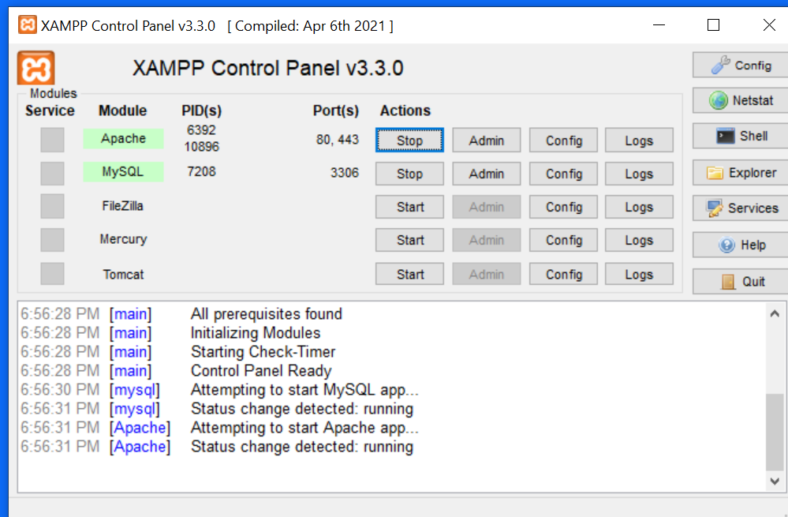
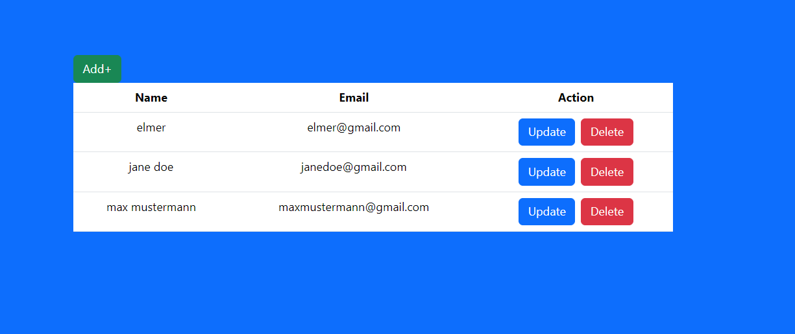
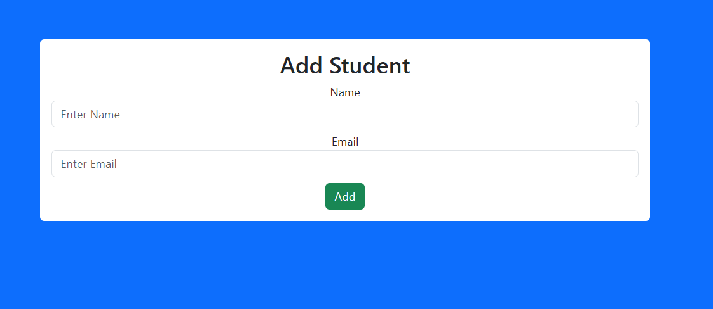
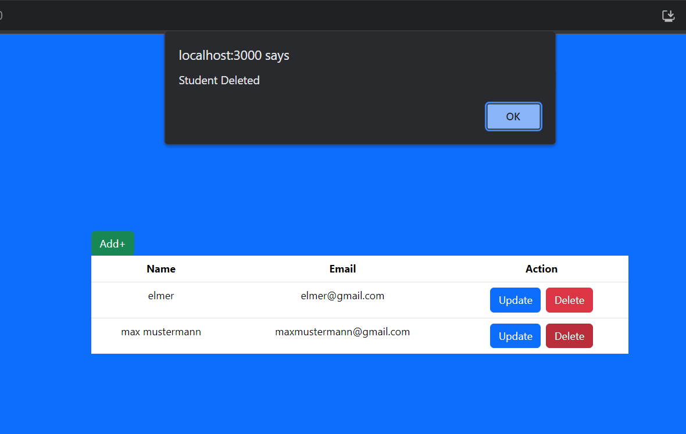

# Student Management System
Simple Student Management System using ReactJs, NodeJs, ExpressJs, SQL
<h2><b>XAMPP</b> is <b> required </b> to run this project</h2>

<b>XAMPP</b> is used for the database management. (settings below)



```Javascript
//install the required packages
npm install

```
```Javascript
// Run server
cd backend
node server.js
```
```Javascript
//Run client
cd ..
cd frontend
npm run start
```



